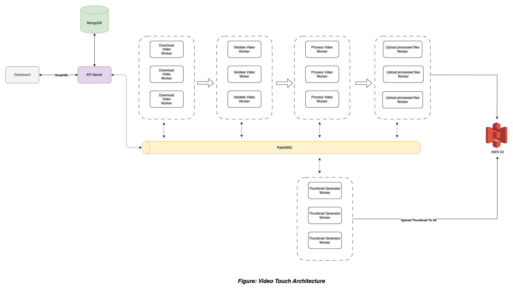
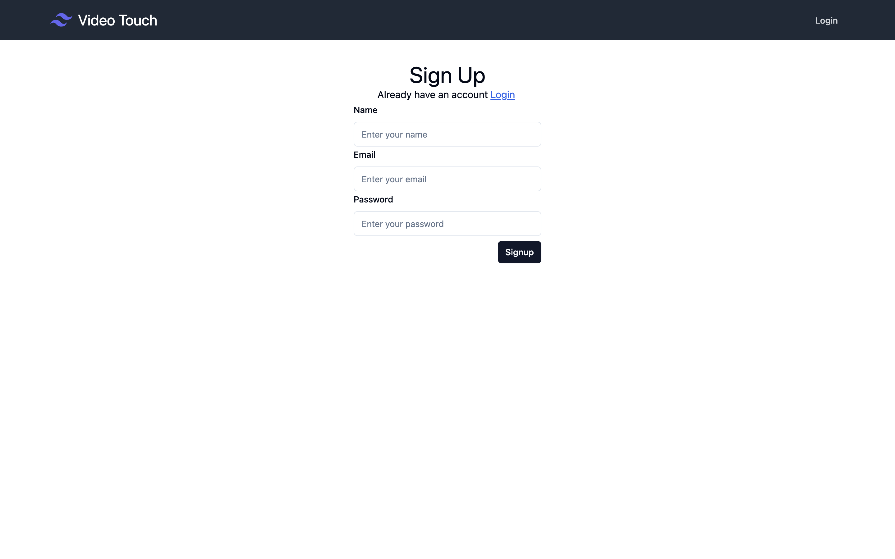
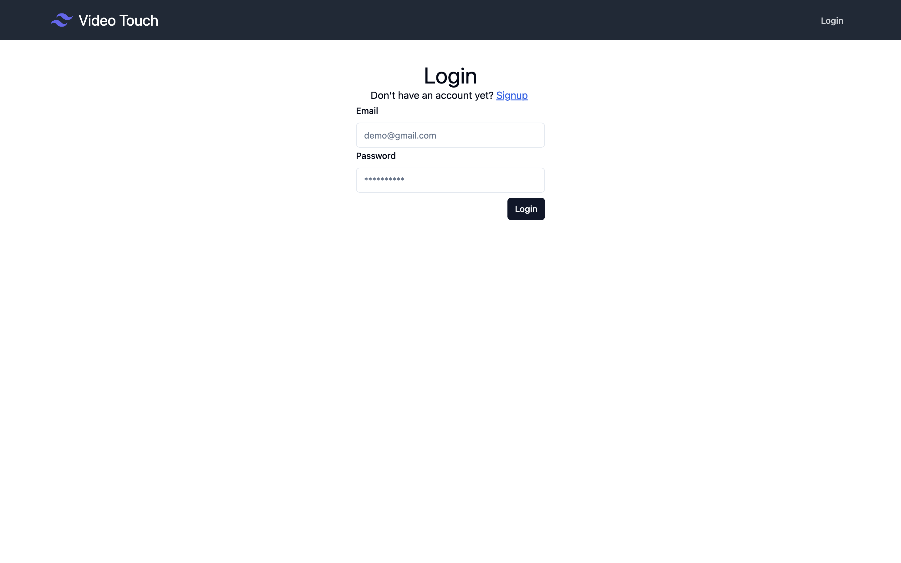
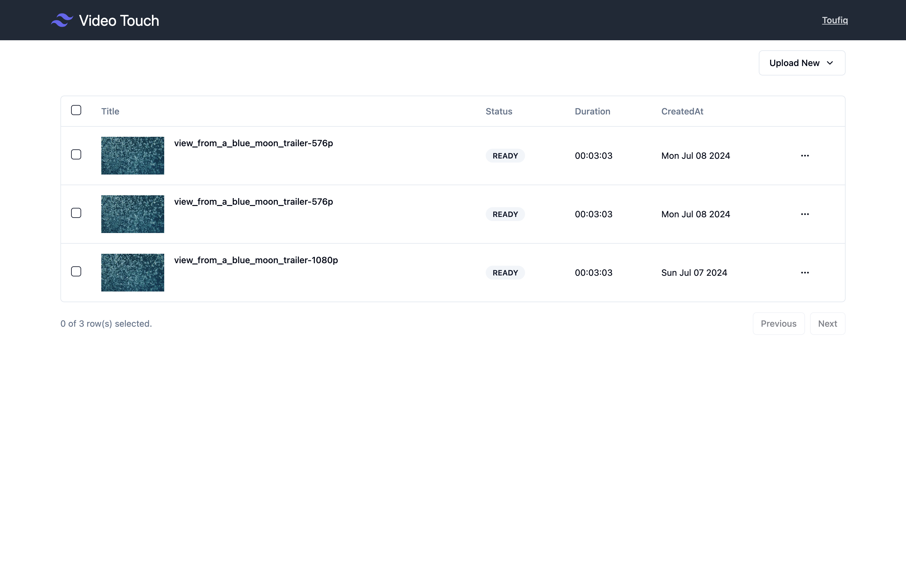
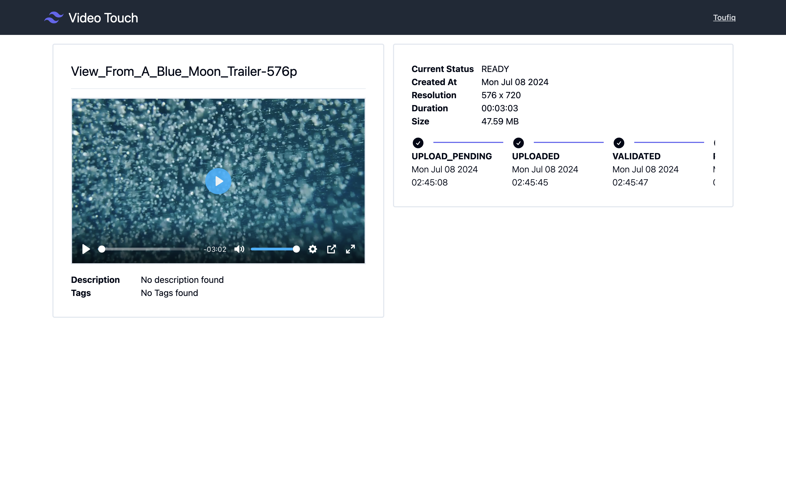
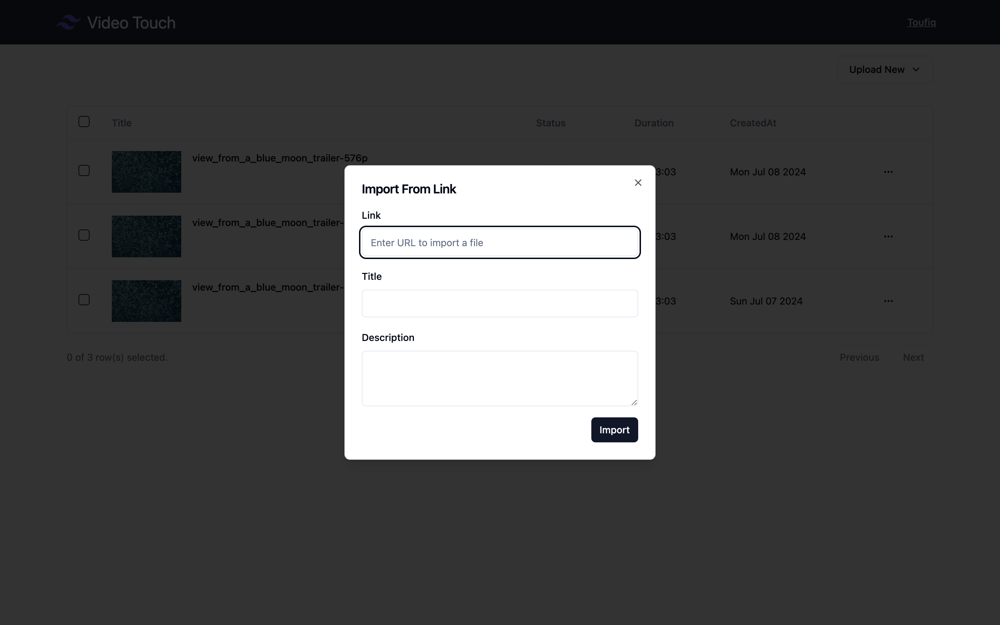
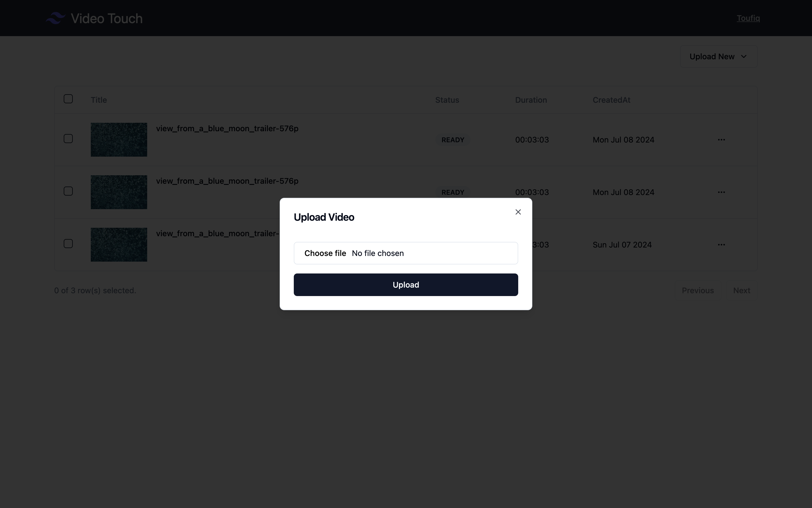
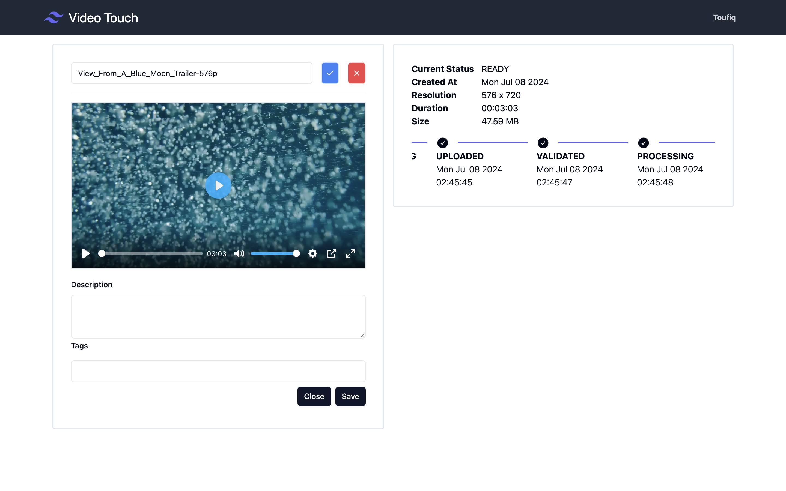

# Video Touch
> Video Touch is a Video Hosting & Streaming platform. In Video Touch users can easily upload, manage and stream videos on demand.

## Table Of Contents
- [The Goals of This Project](#goal)
- [Features](#features)
- [Technologies](#technologies---libraries)
- [Backend Architecture](#the-domain-and-bounded-context---service-boundary)
- [How to Run](#how-to-run)
- [Documentation Apis](#documentation-apis)
- [Frontend](#frontend)

<a id="goal"></a>
### The Goals Of This Project
---
*  Implementing video processing with the help of asynchornus job queue
*  Generating video thumbnail
*  Using RabbitMQ as a Job Queue
*  Using Event Driven Communications
*  Using GraphQL for client side communications
*  Using AWS s3 as storage
*  Stream videos with CDN (AWS Cloudfront)
*  Building a simple Dashboard with Next.js and shadcn/ui
*  Using Github Actions for implenting CI
*  Using Docker-Compose for our deployment mechanism.

<a id="features"></a>
### Features
---
* User Login/Registration
* Video Upload
* Video Transcoding in several resolutions(720p,540p,480p,360p)
* Automatic Thumbnail Generation
* Stream videos on Demand with CDN

<a id="technologies"></a>
### Technologies
---
* [NestJS](https://nestjs.com/) - A progressive Node.js framework
* [MongoDB](https://www.mongodb.com/) - As Database
* [RabbitMQ](https://www.rabbitmq.com/) - As Job Queue and Event Driven Communications
* [GraphQL](https://graphql.org/) - For writing Client Side API's
* [AWS S3](https://aws.amazon.com/s3/) - As Video Storage
* [AWS CloudFront](https://aws.amazon.com/cloudfront/) - As CDN
* [Next.js](https://nextjs.org/) - For developing dashboard
* [shadcn/ui](https://ui.shadcn.com/) - UI compoenent
* [Docker](https://www.docker.com/) - For deployment
* [Github Actions](https://github.com/features/actions) - For CI

<a id="backend-architectire"></a>
### Backend Architecture
---



<a id="how-to-run"></a>
### How To Run
---
To run this project locally, follow these steps:
1. Clone this repository
```
git clone git@github.com:toufiq-austcse/video-touch.git
```
2. Run server app
  *   You will need AWS credentials, S3 Bucket and Cloudfront distribution
  *   From project directory run the following commands:
      ```
      cd server
      cp example.env .env
      ```
  *   Put your aws credentials, s3 bucket name and cloudfront cdn url in the following env's value
      ```
      AWS_ACCESS_KEY_ID=
      AWS_REGION=
      AWS_SECRET_ACCESS_KEY=
      AWS_S3_BUCKET_NAME=
      CDN_BASE_URL=
      ```
  *  Create a seperate diretory for videos in your s3 bucket and put directory url in the following env value. Example value `https://test-bucket.s3.ap-southeast-1.amazonaws.com/videos`

       ```
       VIDEO_BASE_URL=
      ```
  * Put your JWT secret key and token expiren value in seconds in the following env's value
       ```
      JWT_SECRET=
      JWT_EXPIRATION_TIME_IN_SEC=
       ```     
  * Run the follwong command
       ```
          docker compose up -d
       ```
3. Run the Frontend app
  *   From project directory run the following commands:
      ```
      cd frontend
      docker compose up -d
      ```


<a id="frontend"></a>
### Frontend
---
<details>
<summary>Click here to show the screenshots of the project</summary>
    <p> SignUp Page </p>
    
   <p> Login Page </p>
    
   <p> Dashboard </p>
    
    <p> Video Details Page </p>
    
    <p> Import Video From Link </p>
    
    <p> Upload Video</p>
    
    <p> Edit Video Details </p>
    


</details>

